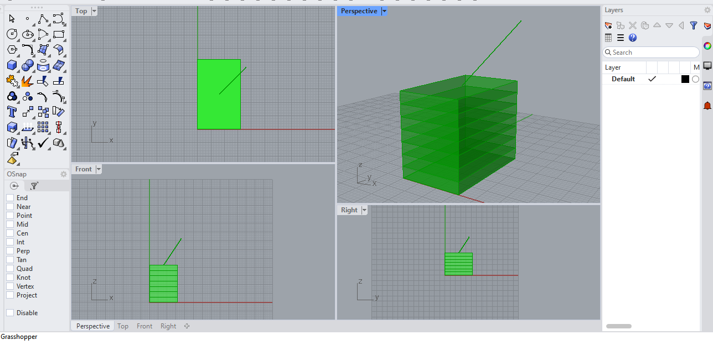

# Phase 4: Live Parametric Rhino & Grasshopper Integration

This module bridges cloud-based Python logic directly into **Rhino 3D** and **Grasshopper**, generating real-time, native architectural geometry.

## 🛠️ Features
- **Live Geometry Engine:** Generates structural floor slabs, 3D building envelope, and solar vectors directly inside Rhino's viewport via GhPython.
- **Parametric Adaptability:** Instantly updates floor counts, height metrics, and envelope boundaries dynamically.
- **Solar Vector Overlay:** Draws environmental sun rays mapped to real microclimate coordinates over the 3D mass.

### 📊 Live Rhino Viewport Output

