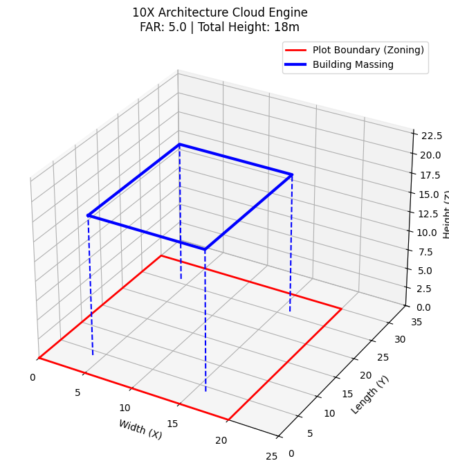
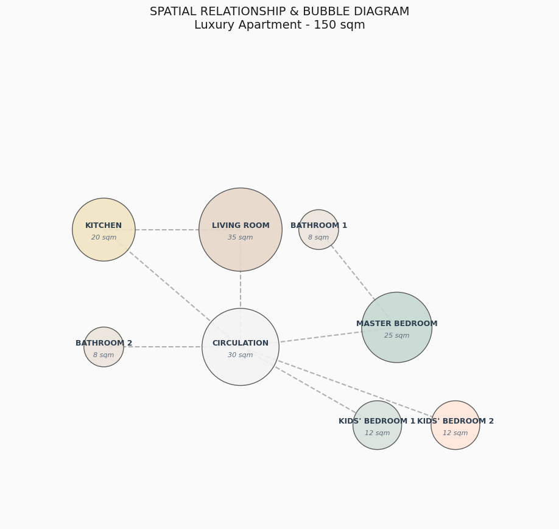

# AI-Powered Computational Architecture Core Engine

An end-to-end autonomous architecture ecosystem designed to automate real estate development workflows—from raw municipal zoning law analysis to generative 2D spatial programming.

## 🎯 The Core Vision
Traditional architectural feasibility and early-stage programming take weeks of manual drafting, cross-referencing, and spreadsheet calculations. This multi-phase project showcases an autonomous pipeline that reduces a **2-week workflow into less than 5 seconds** with 0% human error, maximizing commercial efficiency.

---

## 🏗️ Phase 1: Autonomous Zoning Law & 3D Envelope Auditor
Located in the `01_Zoning_and_Massing/` directory, this sub-agent extracts structural limits from raw, human-written city council texts and translates them into architectural geometry.

### How It Works:
1. **The Brain:** Utilizes `OpenRouter/GPT-4o` to parse complex zoning legal codes and extract FAR (Floor Area Ratio), setbacks, and plot limits into a structured JSON dict.
2. **The Cloud 3D Engine:** Injects that JSON payload directly into a vector engine to dynamically render the maximum legal 3D boundary envelope of the building.
3. **The Auditor:** Compares the designed area against regional caps, issuing an automated `APPROVED` or `REJECTED` compliance certificate.

### Visual Output:
*Dynamic 3D Zoning envelope generated via cloud code:*

---

## 📐 Phase 2: Generative Space Programming & Presentation Diagram
Located in the `02_Space_Programming/` directory, this sub-agent operates *inside* the approved volume from Phase 1, automating the internal brief breakdown.

### How It Works:
1. **The Allocator:** Takes a raw client brief (e.g., "Luxury 150 sqm apartment with 3 bedrooms") and programmatically breaks it down into individual room metrics based on international standards.
2. **The Vector Layout:** Calculates room dimensions ($\sqrt{Area}$) and plots an intuitive, presentation-ready architectural bubble diagram.
3. **Circulation Mapper:** Automates the network graph nodes to draw critical circulation routes and spatial relationships between public and private zones.

### Visual Output:
*Curated, studio-style spatial relationship chart:*

---

## 🛠️ Tech Stack & Skills Showcased
- **AI Agent Engineering:** Advanced prompt engineering, structured JSON extraction via OpenRouter API.
- **Computational Geometry:** Cloud-based 3D/2D spatial rendering using `Matplotlib`, `NumPy`, and Python.
- **Architectural Automation:** High-income skill integration combining algorithmic architectural logic with data pipelines.
